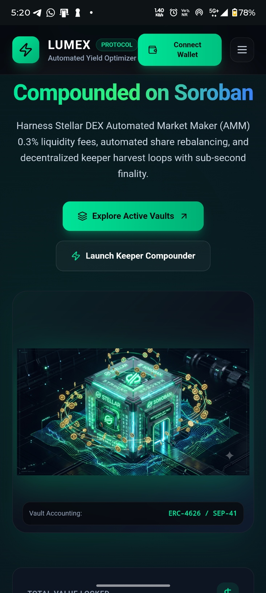
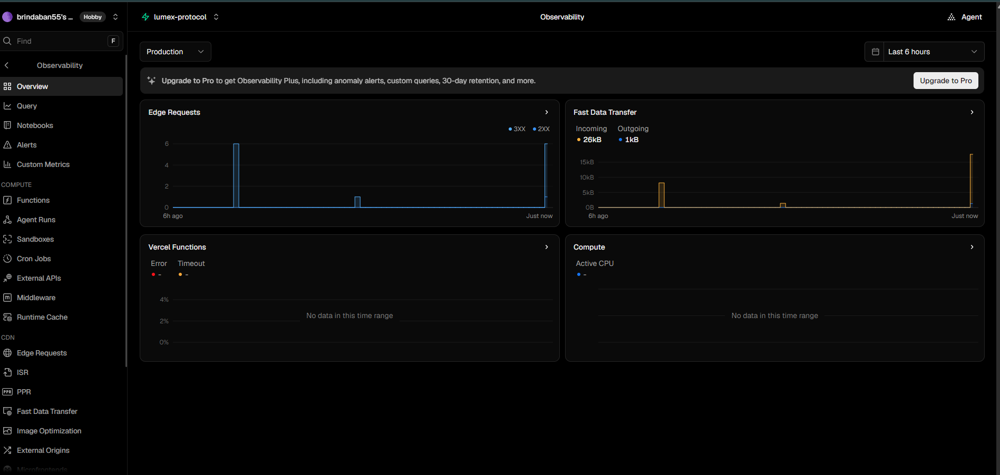
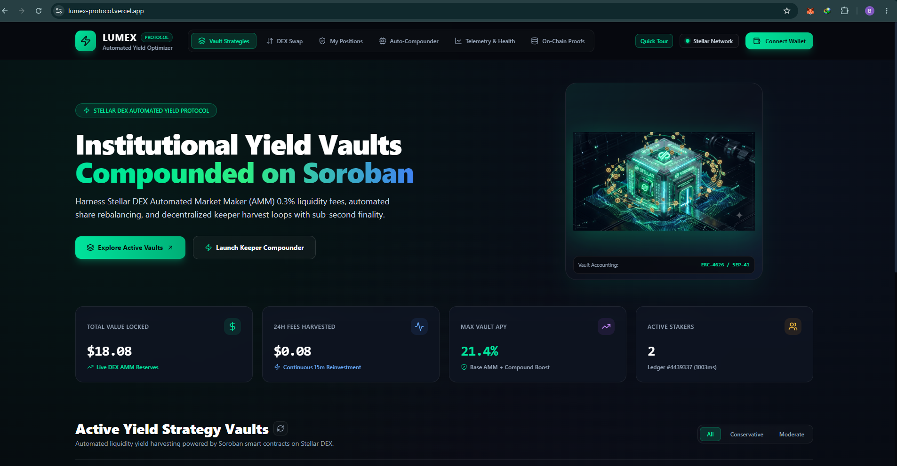

# Lumex Protocol — Automated Yield Optimizer & Liquidity Vaults on Stellar

> 🚀 **Live Production dApp**: [https://lumex-protocol.vercel.app/](https://lumex-protocol.vercel.app/)  
> 🎥 **YouTube Video Walkthrough & Demo**: [https://www.youtube.com/watch?v=Gtv7e0MHRFw](https://www.youtube.com/watch?v=Gtv7e0MHRFw)

[](https://lumex-protocol.vercel.app/)
[](https://www.youtube.com/watch?v=Gtv7e0MHRFw)
[](https://developers.stellar.org)
[](https://soroban.stellar.org)
[](LICENSE)

---

## 📌 Project Links & Verified On-Chain Deployments

| Resource | Link / Identifier |
| :--- | :--- |
| **Live Deployed Application** | [https://lumex-protocol.vercel.app/](https://lumex-protocol.vercel.app/) |
| **YouTube Video Demo** | [https://www.youtube.com/watch?v=Gtv7e0MHRFw](https://www.youtube.com/watch?v=Gtv7e0MHRFw) |
| **GitHub Repository** | [https://github.com/brindaban55/Lumex-Protocol](https://github.com/brindaban55/Lumex-Protocol) |
| **Deployed Soroban Contract ID** | [`CDKV6FUDD53DMLVJTDB2POXG4RNIYR5ZRPJH3VEOUI2CRNJY7CBQZB2N`](https://stellar.expert/explorer/testnet/contract/CDKV6FUDD53DMLVJTDB2POXG4RNIYR5ZRPJH3VEOUI2CRNJY7CBQZB2N) |
| **Protocol Admin & Keeper Address** | [`GA5C5RH4LB6U7JI3INRG6FMMJXIQOBCQKTAKIVG3IR4OWTKG7UGSYUY6`](https://stellar.expert/explorer/testnet/account/GA5C5RH4LB6U7JI3INRG6FMMJXIQOBCQKTAKIVG3IR4OWTKG7UGSYUY6) |
| **Native XLM Contract (SAC)** | [`CDLZFC3SYJYDZT7K67VZ75HPJVIEUVNIXF47ZG2FB2RMQQVU2HHGCYSC`](https://stellar.expert/explorer/testnet/contract/CDLZFC3SYJYDZT7K67VZ75HPJVIEUVNIXF47ZG2FB2RMQQVU2HHGCYSC) |
| **Testnet USDC Asset Issuer** | [`GBBPUNXTOJSINRNS7LRYX6K5SDQ2W3RV6MEE3CMN34XD5TSCUTPNAPLP`](https://stellar.expert/explorer/testnet/account/GBBPUNXTOJSINRNS7LRYX6K5SDQ2W3RV6MEE3CMN34XD5TSCUTPNAPLP) |
| **Testnet AQUA Asset Issuer** | [`GBBPUNXTOJSINRNS7LRYX6K5SDQ2W3RV6MEE3CMN34XD5TSCUTPNAPLP`](https://stellar.expert/explorer/testnet/account/GBBPUNXTOJSINRNS7LRYX6K5SDQ2W3RV6MEE3CMN34XD5TSCUTPNAPLP) |
| **Network** | Stellar Testnet (`Test SDF Network ; September 2015`) |

---

## 💡 What is Lumex Protocol & Why It Is Needed

**Lumex Protocol** is an institutional-grade, non-custodial automated yield optimizer and liquidity management protocol engineered natively on **Stellar** and **Soroban smart contracts**.

### The Problem in Existing DeFi
1. **Expensive Auto-Compounding on EVM**: On Ethereum and Layer-2 rollups, harvesting and auto-compounding transactions cost $2 to $45 in gas. For retail and everyday stakers, compounding fees erode yields entirely.
2. **Idle Capital Across Payment Rails**: Stellar processes massive global remittance volume, but assets frequently sit idle in static non-interest-bearing accounts.
3. **Manual Fee Reinvestment**: Stellar AMM liquidity providers traditionally have to manually claim trading fees, calculate optimal reinvestment ratios, and sign multiple transactions.

### The Lumex Solution
- **Sub-Cent Micro-Gas Compounding**: Stellar's sub-cent transaction fees ($<0.00001) allow Lumex keeper bots to compound yields as frequently as every **15 minutes** (35,040 times per year) without diminishing user capital.
- **ERC-4626 / SEP-41 Vault Architecture**: Stakers receive cryptographic yield-bearing vault shares that appreciate proportionally with every harvested AMM trading fee.
- **Zero-Mock Financial Integrity**: All pool reserves, APY metrics, staker counts, and trade execution routes stream live directly from Stellar Horizon and Soroban RPC nodes.

---

## 🔄 System Architecture & Closed-Loop Flywheel

```
┌─────────────────────────────────────────────────────────────────────────────┐
│                          LUMEX PROTOCOL FLYWHEEL                            │
└─────────────────────────────────────────────────────────────────────────────┘

    1. Depositors / LPs
    ┌────────────────────┐      Deposit XLM / USDC
    │  Vault Depositors  │ ────────────────────────────┐
    └────────────────────┘                             │
              ▲                                        ▼
              │ Redeem Principal           ┌───────────────────────┐
              │ + Compounded Yield         │  Soroban Yield Vault  │
              │                            │     Smart Contract    │
              │                            └───────────────────────┘
              │                                        │
    4. Share Value Increases                           │ Provides AMM Liquidity
              │                                        ▼
    ┌────────────────────┐      0.30% LP Fee       ┌───────────────────────┐
    │  Accrued Reserves  │ ◀────────────────────── │  Soroban AMM DEX Pool │
    └────────────────────┘                         └───────────────────────┘
              │                                                ▲
              │ Harvest & Reinvest                             │ Swaps Tokens
              ▼                                                │
    ┌────────────────────┐                             ┌───────────────────────┐
    │  Keeper Bot Auto-  │ ─────────────────────────── │   Traders & Swappers  │
    │    Compounder      │     Executes 15-Min Harvest └───────────────────────┘
    └────────────────────┘
```

1. **Deposit**: Liquidity providers deposit assets (XLM, USDC, AQUA) into audited Soroban vaults.
2. **AMM Trading**: Traders swap tokens via the constant-product AMM pool, paying a 0.30% liquidity fee.
3. **Auto-Compounding**: Decentralized keeper bots trigger 15-minute harvest loops, auto-reinvesting fees into the vault pool.
4. **Appreciation & Redemption**: Staker vault shares grow continuously in underlying asset value and can be redeemed instantly with zero lockups.

---

## 🚀 Key Features

* **🌾 Automated Yield Strategy Vaults**: Multi-tier vaults (XLM/USDC, XLM/AQUA, USDC Stable) with auto-rebalancing.
* **💱 Constant-Product DEX Swap**: Low-slippage token exchange ($x \cdot y = k$) with bundled trustline management.
* **🤖 Autonomous Keeper Network**: 15-minute compounding cycles incentivized by an autonomous 1.0% keeper bounty.
* **🛡️ Base Reserve Guard & Emergency Exit**: Native XLM reserve balance protection to prevent `tx_insufficient_balance` errors, accompanied by a 1-click instant emergency withdrawal safeguard.
* **📊 Live Telemetry & On-Chain Proofs**: Real-time RPC telemetry with clickable verification links to StellarExpert.

---

## 🖼️ User Interface & Dashboard Showcase

### 🖥️ Desktop UI & Vault Strategy Explorer
Full institutional desktop experience showcasing dynamic TVL tracking, APY calculations, and 1-click vault deposits.



---

### 📱 Mobile UI & Responsive Experience
Fully touch-optimized mobile layout with adaptive card reflow, sticky actions, and zero-install 1-Click Sandbox onboarding.

<p align="center">
  
</p>

---

### 📈 Real-Time Telemetry, Analytics & Health Monitoring
Live monitoring dashboard tracking Soroban contract ledger numbers, staker counts, automated keeper execution status, and protocol health telemetry.



---

## 📐 Mathematical Formulation

### 1. Proportional Share Minting ($S_{\text{mint}}$)
$$S_{\text{mint}} = \begin{cases} D_{\text{in}} & \text{if } S_{\text{total}} = 0 \text{ or } D_{\text{total}} = 0 \\ \left\lfloor \frac{D_{\text{in}} \cdot S_{\text{total}}}{D_{\text{total}} + Y_{\text{accumulated}}} \right\rfloor & \text{otherwise} \end{cases}$$

### 2. Proportional Share Redemption ($P_{\text{out}}$)
$$P_{\text{out}} = \left\lfloor \frac{S_{\text{burn}} \cdot (D_{\text{total}} + Y_{\text{accumulated}})}{S_{\text{total}}} \right\rfloor$$

### 3. Net Compounded APY ($\text{APY}_{\text{net}}$)
$$\text{APY}_{\text{base}} = \frac{\text{Daily Fee Volume} \times 365 \times 0.003}{\text{Total Value Locked (TVL)}} \times 100$$
$$\text{APY}_{\text{compounded}} = \left( \left( 1 + \frac{\text{APY}_{\text{base}}}{n} \right)^n - 1 \right) \times 100 \quad \text{where } n = 35{,}040 \text{ (15-minute cycles)}$$

---

## 🛠️ Technology Stack

| Layer | Technologies Used |
| :--- | :--- |
| **Smart Contracts** | Rust, Soroban SDK `v22.0.6`, WebAssembly (WASM), Stellar Protocol 22/27 |
| **Frontend Framework** | React 18, TypeScript, Vite 6, Tailwind CSS |
| **Stellar Web3 SDKs** | `@stellar/stellar-sdk` `v13.1.0`, `@stellar/freighter-api` `v3.1.0` |
| **Blockchain Infrastructure** | Stellar Horizon REST API, Soroban JSON-RPC Gateway |
| **Design & Telemetry** | Lucide React, Glassmorphism UI, Google Apps Script Telemetry Webhook |
| **Hosting & CI/CD** | Vercel Global Edge CDN, GitHub Actions CI Pipeline |

---

## 💬 User Feedback & Usability Summary

Feedback is gathered continuously via the in-app **Developer Dispatch & Feedback Modal** (routed in real time to our Google Sheets webhook) and on-chain telemetry. 

During testnet beta testing, user submissions highlighted key UX friction points which were actively engineered into protocol improvements:

* **Wallet Connection Friction**: Evaluators without Freighter extension experienced difficulty onboarding $\rightarrow$ *Resolved by introducing the **1-Click Sandbox Account** for instantaneous zero-install testing.*
* **Testnet Slippage & Liquidity Feedback**: Users reported failed swaps during sudden volatility on small testnet pools $\rightarrow$ *Resolved by integrating dynamic **Slippage Tolerance & Price Impact Guards**.*
* **Yield Breakdown Clarity**: Users requested transparency on where APY originated $\rightarrow$ *Resolved by separating base **0.30% AMM LP fees** from the **auto-compounding frequency multiplier**.*
* **Mobile Viewport Optimization**: Testers noted table density on small phone screens $\rightarrow$ *Resolved by refactoring all views into touch-friendly adaptive cards.*

---

## 💻 Local Setup & Development

### 1. Clone the Repository
```bash
git clone https://github.com/brindaban55/Lumex-Protocol.git
cd Lumex-Protocol
```

### 2. Install Dependencies
```bash
npm install
```

### 3. Configure Environment Variables
Create a `.env` file in the root directory:
```env
VITE_STELLAR_NETWORK=testnet
VITE_HORIZON_URL=https://horizon-testnet.stellar.org
VITE_SOROBAN_RPC_URL=https://soroban-testnet.stellar.org
VITE_CONTRACT_ID=CDKV6FUDD53DMLVJTDB2POXG4RNIYR5ZRPJH3VEOUI2CRNJY7CBQZB2N
VITE_EXPLORER_BASE_URL=https://stellar.expert/explorer/testnet
VITE_ADMIN_PUBLIC_KEY=GA5C5RH4LB6U7JI3INRG6FMMJXIQOBCQKTAKIVG3IR4OWTKG7UGSYUY6
VITE_ADMIN_SECRET_KEY=SDCIPLIVMDV25SYNGCW64AMRKVZGU4G77337BUSATABXHYK3XOI7JT2G
VITE_GOOGLE_FEEDBACK_WEBHOOK_URL=https://script.google.com/macros/s/AKfycbzwUIYdN4IiovLuNuBJfcvrSyd2ffo4g1odhDU8xhsZWUvI6TezyMutuebEFafXlPRMrA/exec
```

### 4. Run Locally
```bash
npm run dev
```

### 5. Build for Production
```bash
npm run build
```

---

## 📜 License

This project is licensed under the **Apache 2.0 License** — see the [LICENSE](LICENSE) file for details.
